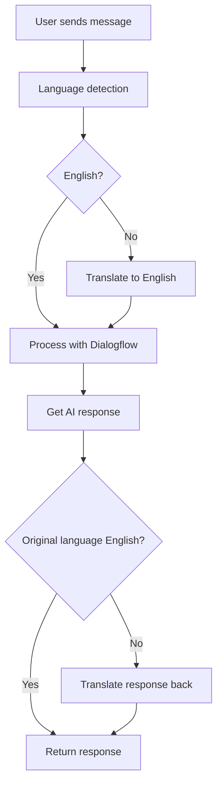

# 🌐 Multi-Language Chatbot 🤖


A powerful AI-powered chatbot solution that provides seamless multilingual support for businesses and applications. This project integrates Google Dialogflow for natural language processing with automatic language detection and translation capabilities.

## ✨ Features

- 🗣️ **Multilingual Support** - Automatic language detection and translation
- 🤖 **AI-Powered Conversations** - Natural language processing via Google Dialogflow CX
- 🌐 **Web Interface** - Modern, responsive chat UI
- 🔌 **RESTful API** - Easy integration with existing systems
- 🔒 **Production-Ready** - Includes security headers, rate limiting, and monitoring

## 🛠️ Technology Stack

| Component | Technology |
|-----------|------------|
| Backend | Python, Flask |
| NLP Engine | Google Dialogflow CX |
| Translation | Langdetect, Deep Translator |
| Frontend | HTML, CSS, JavaScript |
| Deployment | Google Cloud Run |
| Monitoring | Prometheus, Sentry |

## 📋 Prerequisites

Before you begin, ensure you have:

- Python 3.8 or higher
- Google Cloud Platform account
- Dialogflow CX agent set up
- GCP credentials configured

## 🚀 Getting Started

### 1️⃣ Clone the repository

```bash
git clone https://github.com/yourusername/multi-language-chatbot.git
cd multi-language-chatbot
```

### 2️⃣ Set up virtual environment

```bash
python -m venv venv
source venv/bin/activate  # On Windows: venv\Scripts\activate
```

### 3️⃣ Install dependencies

```bash
pip install -r requirements.txt
```

### 4️⃣ Configure environment variables

Create a `.env` file in the project root:

```
PORT=8080
HOST=0.0.0.0
FLASK_DEBUG=0
GOOGLE_APPLICATION_CREDENTIALS=path/to/your/credentials.json
```

### 5️⃣ Run the application

```bash
python main.py
```

## 🏗️ Project Structure

```
multi-language-chatbot/
├── .gitignore                # Git ignore file
├── README.md                 # Project documentation
├── requirements.txt          # Python dependencies
├── dialogflow_api.py         # Dialogflow integration
├── main.py                   # Flask application
├── translate.py              # Translation services
├── static/                   # Static assets
│   ├── chat-interface-css.css  # Chat UI styles
│   ├── chat-interface-js.js    # Chat UI functionality
│   ├── script.js             # General scripts
│   └── style.css             # Global styles
└── templates/                # HTML templates
    ├── bot.html              # Bot interface
    ├── chat.html             # Chat interface
    └── index.html            # Landing page
```

## 🔄 How It Works



1. User sends a message through the web interface
2. System detects the language of the message
3. If not English, translates to English
4. Processes the message through Dialogflow
5. Translates response back to original language if needed
6. Returns response to user

## 🚢 Deployment

The application is designed to be deployed on Google Cloud Run:

```bash
gcloud run deploy multi-language-chatbot \
  --source . \
  --platform managed \
  --region us-central1 \
  --allow-unauthenticated
```

## 📚 Resources

- [Dialogflow CX Documentation](https://cloud.google.com/dialogflow/cx/docs/how/detect-intent-stream)
- [Dialogflow CX Setup Guide](https://cloud.google.com/dialogflow/cx/docs/quick/setup)
- [Cloud Run Deployment Guide](https://cloud.google.com/run/docs/quickstarts/build-and-deploy/deploy-python-service)
- [Dialogflow Python Client Library](https://cloud.google.com/dialogflow/cx/docs/reference/library/python)

## 📝 License

This project is licensed under the MIT License

## 🤝 Contributing

Contributions are welcome! Please feel free to submit a Pull Request.

---

<p align="center">
  Built with ❤️ for seamless multilingual communication
</p>
